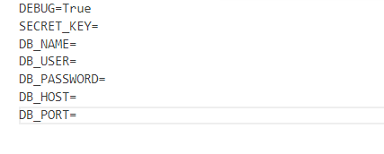
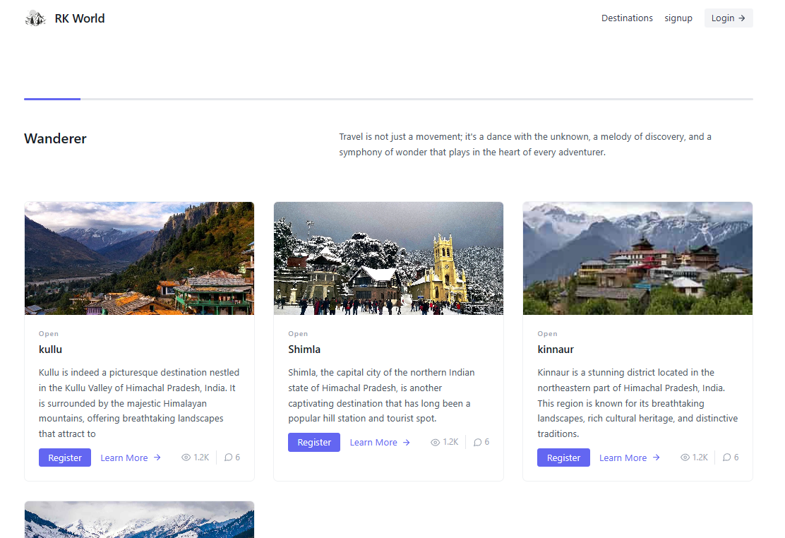
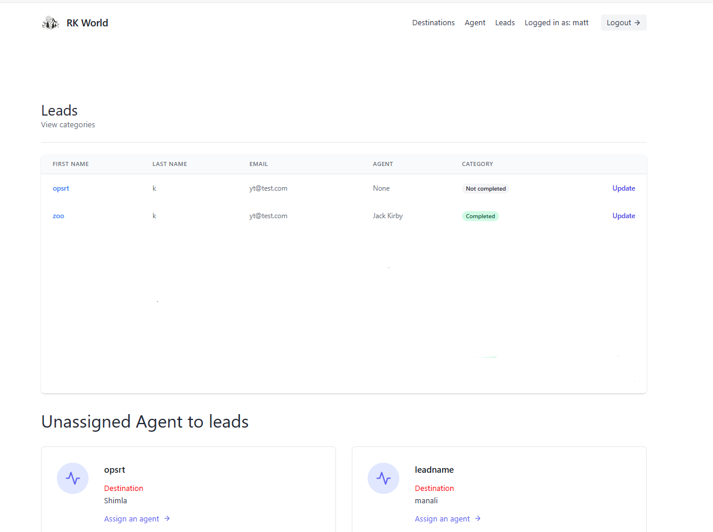
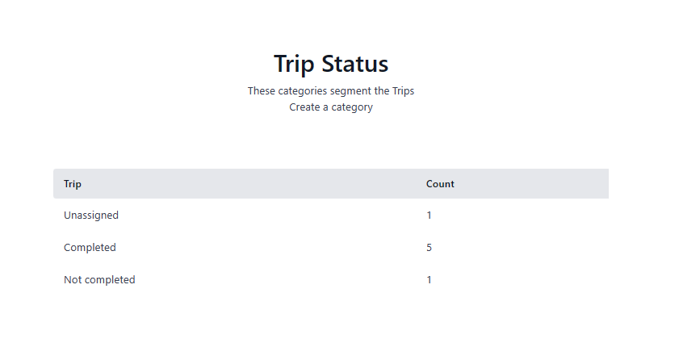
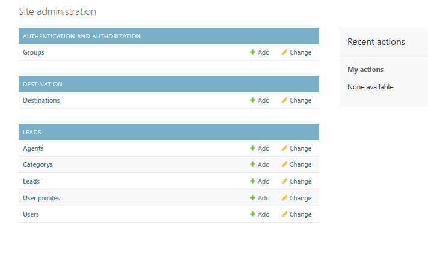

# Travel Agency Django Project
This Django Travel Agency project offers a comprehensive platform for users to plan and book their travel experiences. 
## **Project Overview**
This Django Travel Agency project integrates user authentication, enabling users to securely register for specific destinations and engage with agents based on their expertise and location. Organizers exercise administrative control through an interactive admin panel, facilitating the creation, updating, and deletion of destinations and agents.

Additionally, the Organizer has detailed oversight, tracking the number of users assigned to each agent. Agents, upon login, gain access to a personalized dashboard where they can view and manage users registered under their guidance. 


The application encompasses essential features such as user authentication, registration, messaging capabilities upon registration and agent creation, and password reset functionality, offering a comprehensive and user-friendly experience


## **Getting Started**

&nbsp;&nbsp;&nbsp;These instructions will let you run project on your local machine for development and testing purposes. 

### &nbsp;&nbsp;&nbsp;**Prerequisites**

* &nbsp;&nbsp;&nbsp;&nbsp;&nbsp;&nbsp;Make sure you have installed Python 3 on your device
* &nbsp;&nbsp;&nbsp;&nbsp;&nbsp;&nbsp;Configure the application you want for database. like Sqlite, PostgreSQL
### &nbsp;&nbsp;&nbsp;**Installation**

&nbsp;&nbsp;&nbsp;&nbsp;&nbsp;&nbsp;Run the following command to install the dependencies:

```powershell
pip install -r requirements.txt
```


## **Usage**

**To run this project you will need to set your environment variables.**

1. Create a new file named `.env` inside the `travel` folder
2. Copy all of the variables inside `travel/.template.env` and assign your own values to them and paste in your .env file.
   
  
  *Set the environment variable*
1. Run ` $env:READ_DOT_ENV_FILE="true"` inside your terminal so that your environment variables file will be read.


**Go to the travel_project folder on terminal and run commands**

*  To set environment variables
    ```powershell
    $env:READ_DOT_ENV_FILE="true"
    ```
*  Create a superuser which will be organizer.
    ```powershell
        python manage.py createsuperuser
    ```
* To start the server
    ```powershell
        python manage.py runserver
    ```
Then go to the browser and enter the url **http://127.0.0.1:8000/**


## Screenshots

### Landing Page


### Dashboard 
* Organizer and Agent can login or Signup
* People can register to particular destination which they want to visit.



### Organizer View
* on Agent click you can know about agents and create agents, update functionality is availabel. 
* This is the Lead link view for organizer.
  * can update the lead information.
* Unassigned agents
  * This shows the people to whom No agent was assigned or they haven't choose.
* View categories
  * This will rediret to page where organizer can see total number of trips completed and in what can get info about people not completed there trips.




### View categories
* on organizer can see this.
* This shows the 


### Admin Page



## **Conclusion**
In conclusion, this Django Travel Agency project seamlessly integrates PostgreSQL for efficient data management, providing a secure and scalable solution for user registration, agent oversight, and interactive communication. With authentication, administrative control, and personalized organizer,agent dashboards, the project delivers a user-centric and efficient platform for travel enthusiasts and agents alike.
